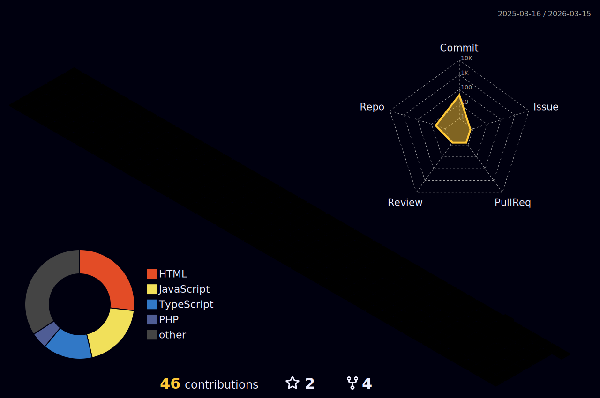

<div align="center">

<!-- Header Banner -->


<!-- Typing Animation -->
[](https://git.io/typing-svg)

<!-- Visitor Counter & Followers -->


<!-- Social Links -->
<br/><br/>
[](mailto:wlsdljuam@nate.com)
[](https://github.com/wlsdljuam)
[](https://koreapeek.com)

</div>

<!-- Wave Divider -->


## About Me

```javascript
const developer = {
    name: "wlsdljuam",
    role: "AI & Web Developer",
    focus: ["AI Visibility", "Web Analytics", "SaaS Development"],
    currentlyLearning: "AI/ML Integration",
    funFact: "I turn coffee into code"
};
```

<!-- Wave Divider -->


## Hobbies & Interests

<div align="center">

| | | | |
|:---:|:---:|:---:|:---:|
|  |  |  |  |

</div>

<!-- Wave Divider -->


## Currently Working On

<div align="center">

| Project | Status | Description |
|:-------:|:------:|:-----------:|
| AIRead | 🔨 In Progress | AI 검색 가시성 분석 SaaS 플랫폼 개발 |
| AEO Trends | 🚀 Active | AI 검색 최적화 트렌드 분석 서비스 |
| Sitemap Generator | 🚀 Active | URL 기반 범용 사이트맵/RSS 생성기 |

</div>

<!-- Wave Divider -->


## Tech Stack

<div align="center">

### Languages


### Frameworks & Libraries


### Database & Cloud


### Tools


</div>

<!-- Wave Divider -->


## Certifications

<div align="center">


</div>

<!-- Wave Divider -->


## Featured Projects

<div align="center">

| Project | Description | Tech Stack |
|:-------:|:-----------:|:----------:|
| [**AI Dashboard**](https://github.com/wlsdljuam/ai-dashboard) | GA4 기반 AI 검색 가시성 분석 |   |
| [**AIRead**](https://github.com/wlsdljuam/airead) | AI 검색 가시성 SaaS 플랫폼 |   |
| [**AEO Trends**](https://github.com/wlsdljuam/aeotrends) | AI 검색 최적화 트렌드 분석 |   |
| [**CleanPixel**](https://github.com/wlsdljuam/cleanpixel) | AI 이미지 처리 앱 |   |
| [**Sitemap Generator**](https://github.com/wlsdljuam/sitemap-generator) | URL 기반 범용 사이트맵/RSS 생성기 |   |

</div>

<!-- Wave Divider -->


## GitHub Stats

<div align="center">

<!-- Stats Cards -->
<picture>
  <source media="(prefers-color-scheme: dark)" srcset="https://github-readme-stats-eight-theta.vercel.app/api?username=wlsdljuam&show_icons=true&theme=tokyonight&hide_border=true&include_all_commits=true&count_private=true" />
  <source media="(prefers-color-scheme: light)" srcset="https://github-readme-stats-eight-theta.vercel.app/api?username=wlsdljuam&show_icons=true&theme=default&hide_border=true&include_all_commits=true&count_private=true" />
  
</picture>
<picture>
  <source media="(prefers-color-scheme: dark)" srcset="https://streak-stats.demolab.com?user=wlsdljuam&theme=tokyonight&hide_border=true" />
  <source media="(prefers-color-scheme: light)" srcset="https://streak-stats.demolab.com?user=wlsdljuam&theme=default&hide_border=true" />
  
</picture>

<br/>

<!-- Most Used Languages -->
<picture>
  <source media="(prefers-color-scheme: dark)" srcset="https://github-readme-stats-eight-theta.vercel.app/api/top-langs/?username=wlsdljuam&layout=compact&theme=tokyonight&hide_border=true&langs_count=8" />
  <source media="(prefers-color-scheme: light)" srcset="https://github-readme-stats-eight-theta.vercel.app/api/top-langs/?username=wlsdljuam&layout=compact&theme=default&hide_border=true&langs_count=8" />
  
</picture>

</div>

<!-- Wave Divider -->


## Profile Summary Cards

<div align="center">


</div>

<!-- Wave Divider -->


## Trophy

<div align="center">

<picture>
  <source media="(prefers-color-scheme: dark)" srcset="https://github-trophies.vercel.app/?username=wlsdljuam&theme=darkhub&no-frame=true&no-bg=true&column=7&margin-w=15" />
  <source media="(prefers-color-scheme: light)" srcset="https://github-trophies.vercel.app/?username=wlsdljuam&theme=flat&no-frame=true&no-bg=true&column=7&margin-w=15" />
  
</picture>

</div>

<!-- Wave Divider -->


## Activity Graph

<div align="center">

<picture>
  <source media="(prefers-color-scheme: dark)" srcset="https://github-readme-activity-graph.vercel.app/graph?username=wlsdljuam&theme=tokyo-night&hide_border=true&area=true" />
  <source media="(prefers-color-scheme: light)" srcset="https://github-readme-activity-graph.vercel.app/graph?username=wlsdljuam&theme=minimal&hide_border=true&area=true" />
  
</picture>

</div>

<!-- Wave Divider -->


## 3D Contribution Graph

<div align="center">



</div>

<!-- Wave Divider -->


## Snake Animation

<div align="center">

<picture>
  <source media="(prefers-color-scheme: dark)" srcset="https://raw.githubusercontent.com/wlsdljuam/wlsdljuam/output/github-contribution-grid-snake-dark.svg" />
  <source media="(prefers-color-scheme: light)" srcset="https://raw.githubusercontent.com/wlsdljuam/wlsdljuam/output/github-contribution-grid-snake.svg" />
  
</picture>

</div>

<!-- Wave Divider -->


## Now Playing on Spotify

<div align="center">

<a href="https://github.com/kittinan/spotify-github-profile">
    
  </a>

</div>

<!-- Wave Divider -->


## Weekly Coding Stats

<div align="center">

[](https://wakatime.com/@tedk)

</div>

<!-- Wave Divider -->


## Random Dev Quote

<div align="center">


</div>

<!-- Wave Divider -->


<div align="center">

### Thanks for visiting!


<!-- Footer Banner -->


</div>
